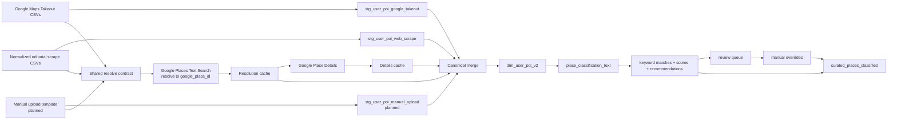

# Curated POI End-to-End Architecture

Last updated: 2026-05-05

## Purpose

This document explains how curated places currently flow through the Stoop data
platform and how we want that flow to evolve. It is meant to answer five core
questions:

1. Where does our place data come from?
2. How do we reconcile duplicate places?
3. How do we get location data?
4. What enriched metadata do we have per place?
5. How do we classify places?

It also separates:

- the current implementation that already exists in the repo
- the target architecture we want to formalize next

## Executive Summary

Today the curated POI pipeline has three source paths:

- Google Maps personal saved-list exports
- editorial and trusted-publication lists normalized into a shared scrape CSV
- planned manual / crowd uploads through a shared template

All paths are intended to land in source-specific staging tables, resolve each
row to a Google `place_id`, enrich that place with Google Place Details, and
merge repeated mentions into one canonical place row in
`property_explorer_gold.dim_user_poi_v2`.

The current implementation is strongest in:

- source normalization
- Google Places resolve and details enrichment
- canonical merge into `dim_user_poi_v2`
- an initial restaurant-focused classification mart with review and override flow

The main architectural gap is that the "pre-canonical dedupe harmonization"
layer is still partly implicit in caches and merge logic rather than exposed as
an explicit managed silver table.

## Current Flow



## Target Flow

```mermaid
flowchart LR
    A[Source captures] --> B[Source-specific raw staging]
    B --> C[Shared normalized source contract]
    C --> D[Pre-resolve harmonization<br/>duplicate candidates by name + address + source clues]
    D --> E[Google Places Text Search<br/>canonical place resolution]
    E --> F[Resolved place harmonization<br/>one row per place_id]
    F --> G[Google Place Details enrichment]
    G --> H[Curated canonical place table]
    H --> I[Classification mart]
    I --> J[Review queue]
    J --> K[Overrides]
    K --> L[Final curated place output for app]
```



## 1. Where Our Place Data Comes From

We currently use three curated source families.

### 1. Personal Google Maps lists

These are Google Takeout CSV exports from saved places. They are our most
personal source because they preserve what we ourselves saved and how we
grouped it.

Important fields from this path:

- place title
- source list name
- notes and comments when available
- tags or source-derived taxonomy hints

Current entry point:

- `src/nyc_property_finder/pipelines/ingest_curated_poi_google_takeout.py`

### 2. Trusted publication lists

These are editorial lists from sources such as Eater, Time Out, Vogue,
Wanderlog, Michelin, Bon Appetit, and NY Mag. Some use publication-specific
parsers and some use a semi-manual article capture plus extraction flow.

Important fields from this path:

- publisher
- article title and URL
- source list name
- item rank
- item name
- raw address
- raw description
- category, subcategory, and detail hints assigned during normalization

Current entry point:

- `src/nyc_property_finder/pipelines/ingest_curated_poi_web_scrape.py`

### 3. Manual or crowd submissions

This path is planned but not fully implemented yet. The intended model is a
shared upload template that normalizes into the same downstream contract as the
other curated sources.

Expected minimum fields:

- name
- address or location clue
- URL
- category
- submitter notes

Reserved package path:

- `src/nyc_property_finder/curated_poi/excel_upload/`

### Common modeling principle

All sources should preserve source-specific lineage first and only then merge
into the canonical place table. That is why the architecture uses
source-specific staging tables instead of writing directly into
`dim_user_poi_v2`.

## 2. How We Reconcile Duplicate Places

Duplicate handling happens in two logical steps.

### Step A. Pre-resolution source harmonization

This is the "same place mentioned multiple ways" problem before we know the
official Google place identity.

Conceptually, this stage uses:

- place name
- address or neighborhood clues
- source list names
- notes, comments, and tags

Current state:

- Google Takeout rows go straight into the shared resolve pipeline.
- Web-scrape rows already do one important optimization before live resolve:
  they check the existing canonical table for exact normalized
  `input_title + address` matches and reuse the known `google_place_id` when
  possible.
- The repo does not yet expose a first-class silver table for fuzzy duplicate
  candidates across all sources. Today that logic is partly embedded in the
  resolution cache and canonical pre-match step.

### Step B. Post-resolution canonical dedupe

Once a row resolves to a Google `place_id`, dedupe becomes much more reliable.
At that point the canonical place key is the resolved `google_place_id`.

Current implementation:

- source rows are resolved into the shared resolution cache
- Place Details are fetched for resolved place IDs
- canonical rows are built one per unique `google_place_id`
- repeated source mentions are merged into JSON-array lineage fields such as
  `source_systems`, `source_list_names`, `categories`, `subcategories`,
  `note`, `tags`, `comment`, and `source_url`

This is the current meaning of "true harmonization" in the repo:

- one canonical row per physical place
- source mentions preserved, not discarded
- Google place identity acts as the durable dedupe anchor

### Target improvement

We should make the intermediate harmonization layer explicit. The target shape
is:

1. source staging
2. pre-resolve duplicate candidate table
3. resolved harmonization table keyed by `google_place_id`
4. final canonical curated place table

That will make QA, debugging, and lineage much easier than relying mainly on
caches plus final-table inspection.

## 3. How We Get Location Data

Location data currently comes from Google Places in two calls.

### Call 1. Text Search resolve

The first call is a search step that resolves a source row into a canonical
Google `place_id`.

What it gives us:

- `google_place_id`
- match status
- a durable identity to continue deduping against

This is the critical bridge from "source mention" to "canonical place."

### Call 2. Place Details enrichment

Once we have a `google_place_id`, we call the Place Details endpoint and cache
the payload.

Fields currently surfaced into `dim_user_poi_v2` include:

- standardized place name
- formatted address
- latitude
- longitude
- rating
- user rating count
- business status
- editorial summary
- editorial summary language code
- price level
- website URI

Important clarification:

- We currently do not persist Google reviews/comments as first-class columns in
  `dim_user_poi_v2`.
- We also do not currently persist Google types in the canonical curated table,
  even though that may become useful for future classification work.

## 4. What Enriched Metadata We Have Per Place

Each canonical place row combines source metadata, taxonomy metadata, and Google
place enrichment.

### Source lineage and editorial context

Current canonical fields preserve:

- `source_systems`
- `primary_source_system`
- `source_record_id`
- `source_list_names`
- `input_title`
- `note`
- `tags`
- `comment`
- `source_url`

This is important because curated places are not just locations. They are
locations plus taste signals. The source itself often tells us why a place
matters.

### Taxonomy and place-shape metadata

Current canonical taxonomy fields are:

- `category`
- `subcategory`
- `detail_level_3`
- `categories`
- `primary_category`
- `subcategories`
- `primary_subcategory`
- `detail_level_3_values`
- `primary_detail_level_3`

These give us:

- one stable top-level bucket
- one stable filter bucket
- a flexible descriptor layer for nuance

### Google place enrichment

Current Google-enriched fields are:

- `google_place_id`
- `match_status`
- `address`
- `lat`
- `lon`
- `has_place_details`
- `details_fetched_at`
- `rating`
- `user_rating_count`
- `business_status`
- `editorial_summary`
- `editorial_summary_language_code`
- `price_level`
- `website_uri`

## 5. How We Classify Places

Classification is where curated source signals become product-facing place
intelligence.

## 5.1 What is our classification hierarchy?

The current hierarchy is:

1. `category`: broad, stable product bucket
2. `subcategory`: stable filterable bucket
3. `detail_level_3`: flexible descriptor layer

Examples:

- `restaurants -> pizza -> slice_shop`
- `restaurants -> japanese -> ramen`
- `bars -> wine_bar -> small_plates`

## 5.2 Which levels are hard categories and which are open-ended?

Current recommendation:

- `category` should stay controlled and relatively hard-coded
- `subcategory` should also stay controlled because it powers filtering,
  reporting, and app UX
- `detail_level_3` should stay semi-open and easier to evolve over time

This matches the current repo design:

- top two levels are sourced from `config/poi_categories.yaml`
- level 3 is the flexible descriptor layer used for richer classification

## 5.3 What are our set categories?

The current curated taxonomy is controlled in `config/poi_categories.yaml`.
The top-level categories presently include:

- `restaurants`
- `bars`
- `bakeries`
- `coffee_shops`
- `food_markets`
- `specialty_grocery`
- `bookstores`
- `record_stores`
- `museums`
- `movie_theaters`
- `music_venues`
- `groceries`
- `shopping`
- `parks`
- `hotels`

We should treat that file as the source of truth for the controlled taxonomy,
not ad hoc SQL logic.

## 5.4 What are the boundaries between similar categories?

A few design rules should stay consistent:

- `category` answers "what broad kind of place is this?"
- `subcategory` answers "what stable user-facing bucket should this place be
  filtered into?"
- `detail_level_3` answers "what extra nuance do we want to preserve?"

Examples of the boundary logic we want:

- a ramen shop is still `category=restaurants`, not a top-level food vertical
- a wine bar can reasonably be `category=bars`, `subcategory=wine_bar`
- a deli-heavy sandwich shop may stay `subcategory=sandwiches`,
  `detail_level_3=deli`
- "fine dining" is often a descriptor, not necessarily its own stable
  subcategory

The guiding principle is stability at levels 1 and 2, nuance at level 3.

## 5.5 What information and business rules do we use?

Current classification inputs include:

- source list names
- tags
- source comments
- Google editorial summary
- current category, subcategory, and detail assignments

The first pass of logic already exists in the place classification mart:

- `place_classification_text`
- `place_word_profile`
- `place_phrase_profile`
- `place_keyword_mapping`
- `place_keyword_matches`
- `place_matched_keywords`
- `place_classification_scores`
- `place_classification_recommendations`
- `place_classification_review_queue`
- `place_classification_overrides`
- `curated_places_classified`

Current business-rule pattern:

- build one normalized text record per place
- match controlled keywords and phrases against multiple text fields
- score candidate classifications
- emit a confidence-ranked recommendation
- route ambiguous or weak cases to a review queue
- let manual overrides win over automated recommendations

Important current-state limitation:

- the mart is most mature for restaurant-family cleanup, especially
  `mixed_restaurants`
- it is not yet a fully generalized classification system across every curated
  top-level category

## 5.6 What is our overall classification pipeline flow?

Current flow:

```text
dim_user_poi_v2
  -> place_classification_text
  -> keyword/phrase matching
  -> candidate scoring
  -> recommendation
  -> review queue
  -> manual override
  -> curated_places_classified
```

This gives us a strong pattern for explainable classification:

- automated where evidence is strong
- reviewable where evidence is weak
- durable where a human has already made the decision

## Current vs Target Architecture

### What already works well

- multiple curated source paths can normalize into a common model
- Google Places gives us a strong canonical identity and reliable coordinates
- canonical merge preserves source lineage instead of flattening it away
- the classification mart already has explainability, scoring, and override
  concepts

### What we should formalize next

- explicit pre-resolve harmonization table instead of mostly implicit cache
  logic
- full manual-upload ingestion path into `stg_user_poi_manual_upload`
- clearer separation between canonical place build and final classified place
  output
- broader classification coverage beyond restaurant-family cleanup
- documented rules for category boundaries and review ownership
- optional future persistence of Google types or other metadata if they improve
  classification quality

## Recommended Next Steps

1. Keep `dim_user_poi_v2` as the canonical enriched place table.
2. Add an explicit harmonization layer between source staging and canonical
   place output.
3. Finish the manual-upload ingestion path so all three source families are live.
4. Treat `curated_places_classified` as the app-facing classified layer once the
   classification mart broadens beyond restaurant cleanup.
5. Expand the classification design into a dedicated follow-on doc for:
   controlled subcategory inventory, boundary rules, confidence policy, and
   reviewer workflow.
